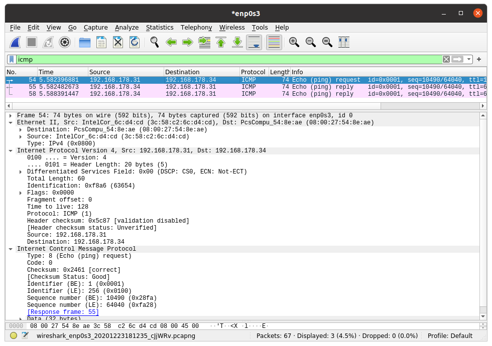
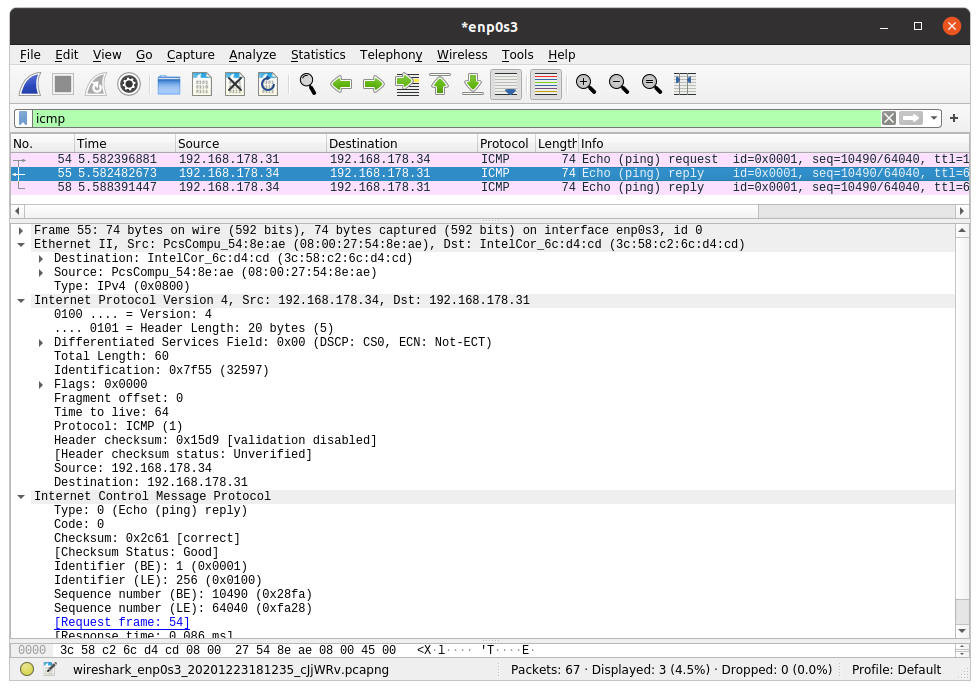
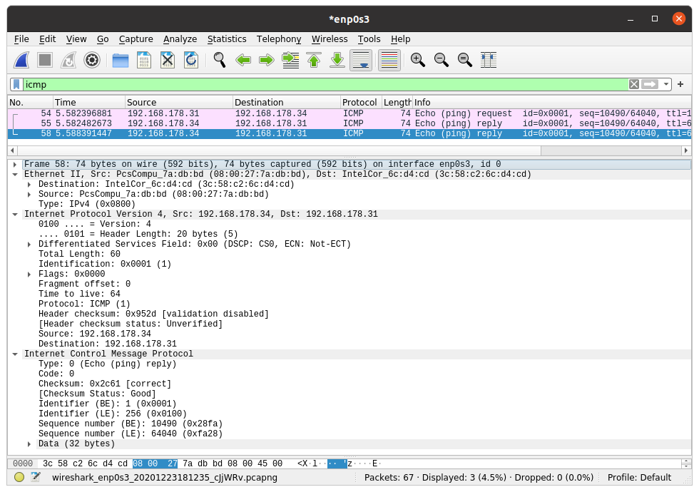
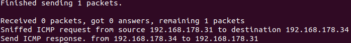
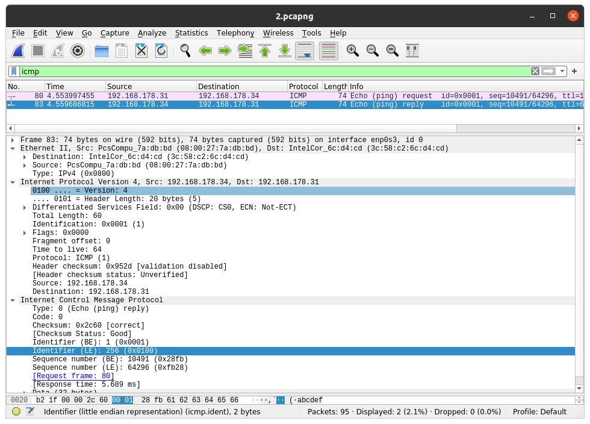
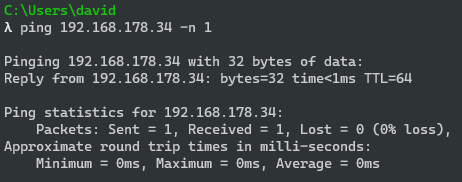
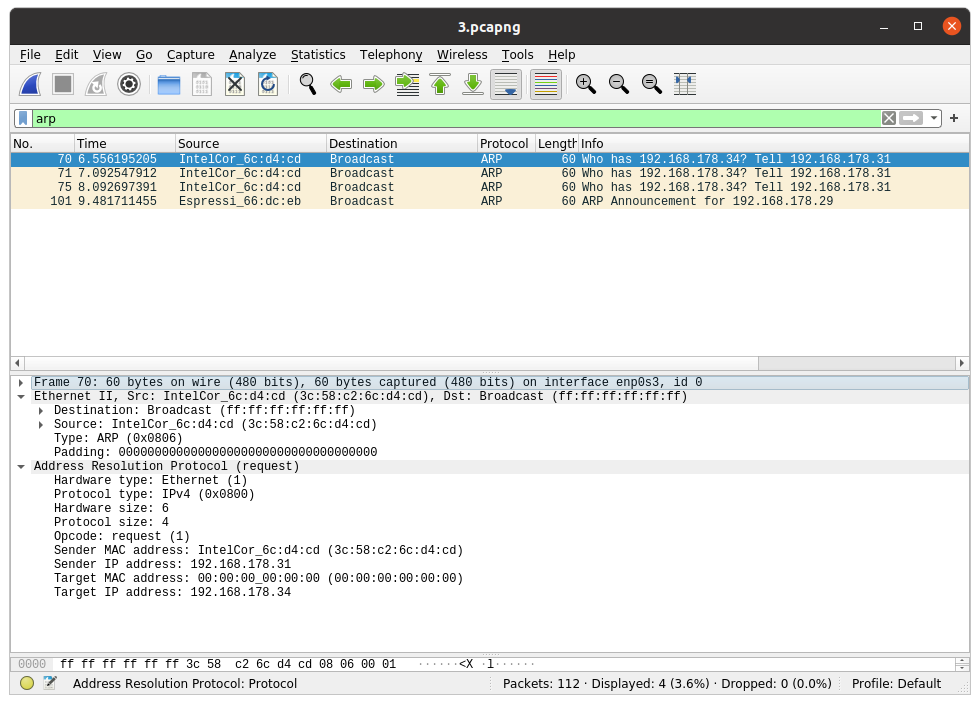
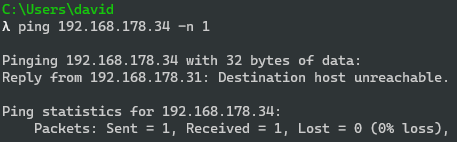

# ICMP Reply Spoofing

This script will spoof ICMP replys. When an ICMP request from A to B is detected the script sends a fake response message with the IP of B back to A.

### Prerequisites
* Python>3.6
* Latest Scapy release
* Ability to catch network traffic that is not directed to the Host the script is running on. The network interface needs to be in promiscuous mode.

### Behaviour

When the host A uses the ping command with the IP address of B an ICMP request is send through the network from A to B.

This ICMP package contains the IP of A as its source and the IP of B as its destination.  
B will respond with an ICMP response to A:
  
The script will create an ICMP response package with A as its destination and B as its source although it runs on a host that is neither A or B.  

  
You can see from the source and destination of the Ethernet packet that this packet does not originate from B.  
The Destination of the request was (08:00:27:54:8e:ae). The source of the spoofed reply is different while the source of the original response is correct.  
  
  
If A sends an ICMP request to B but B was, for example, just shut down, we can observe that the response package from the script  is accepted by A although B is not actually available anymore.  

  
This only works for a limited time.  
After that A will always send an ARP request to find out the MAC address of B. The script does not work then, because otherwise it would have to fake the ARP replies as well.
  
  
Th ping command fails because B is not reachable.
